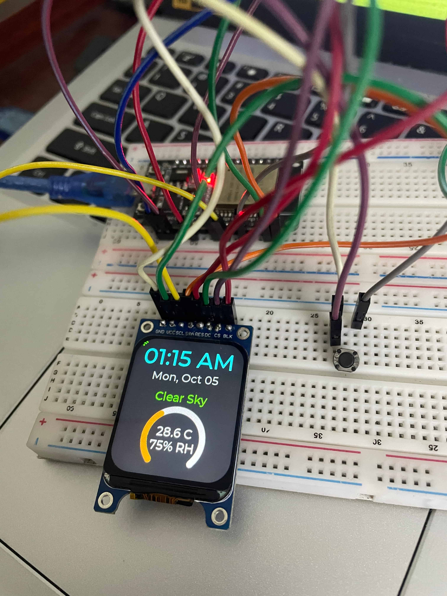

# Multithreaded ESP32 RTOS Dashboard

A professional-grade embedded systems firmware built on the **ESP-IDF v6.0** framework. This project transforms an ESP32 and an ST7789 SPI display into a 3 mode real-time dashboard, demonstrating FreeRTOS task management, REST API parsing, and hardware-accelerated UI rendering.



## Features
* **Mode 1: Smart Environment Dashboard:** Synchronizes SNTP time and fetches live weather data (Temperature, Humidity, WMO conditions) via the Open-Meteo API.
* **Mode 2: RTOS System Telemetry:** A live diagnostics screen monitoring FreeRTOS heap memory, system uptime (`esp_timer`), and Wi-Fi RSSI state to monitor resource constraints.
* **Mode 3: Live ISS Orbital Tracker:** Queries the Open-Notify API, parses real-time latitude/longitude, and uses a custom 2D coordinate-mapping algorithm to plot the International Space Station against a static geographic target (Dhaka, Bangladesh).

## Project Showcase
You can view all raw files in the [`assets/`](assets/) directory.

## Hardware Architecture
* **MCU:** ESP32 DEVKIT-V1 (Xtensa Dual-Core 32-bit LX6 microprocessor)
* **Display:** 1.69" ST7789 TFT LCD (240x280)
* **Input:** Physical push button with hardware pull ups and software debouncing

### Pinout Configuration

| Module | Component Pin | ESP32 Pin | Function |
| :--- | :--- | :--- | :--- |
| **Display** | VCC / VDD | 3.3V | 3.3V Power Supply |
| **Display** | GND | GND | Common Ground |
| **Display** | BLK / LED | 3.3V | Backlight Power (Always On) |
| **Display** | SDA / DIN (MOSI) | GPIO 23 | SPI Data In |
| **Display** | SCL / SCK (SCLK) | GPIO 18 | SPI Clock (10MHz) |
| **Display** | CS | GPIO 5 | Chip Select |
| **Display** | DC | GPIO 22 | Data/Command |
| **Display** | RST / RES | GPIO 4 | Hardware Reset |
| **Input** | Button Leg 1 | GPIO 21 | Mode Toggle (Internal Pull-up) |
| **Input** | Button Leg 2 | GND | Active Low Trigger |

## Software & RTOS Architecture
To prevent watchdog timeouts and guarantee zero-latency UI interactions, the firmware is completely decoupled into distinct FreeRTOS tasks:

1. `ui_update_task` (6KB Stack): The exclusive handler for LVGL drawing operations, running a non-blocking 250ms loop.
2. `button_task` (3KB Stack): A hardware polling task utilizing falling-edge detection and 300ms software debouncing for state-machine navigation.
3. `weather_task` & `iss_task` (8KB/10KB Stacks): Isolated network tasks that dynamically allocate heap memory, execute HTTP GET requests, parse JSON payloads using `cJSON`, and clean up memory to prevent leaks. Background polling is strictly throttled to save CPU cycles.

## Engineering Challenges Overcome
* **Hardware Timing Glitches:** The ST7789 controller occasionally locked up and presented a black screen due to SPI commands arriving before the voltage booster fully initialized. Resolved by injecting a precise `150ms` boot delay post-reset.
* **UI Coordinate Collisions:** Dynamic string lengths (e.g., transitioning from `-23.81` to `23.81N`) caused horizontal text overlapping. Solved by implementing strict absolute anchoring (`LV_ALIGN_LEFT_MID`) to lock text bounding boxes to display edges.
* **ESP-IDF v6.0 PSA Crypto Bug:** The hardware cryptography accelerator crashed on modern SSL certificates (`mbedtls_ssl_handshake returned -0x3000`). Engineered a fallback to a stable HTTP endpoint and injected nominal orbital averages to preserve UI integrity without bypassing system security.

## Build Instructions
This project uses the official Espressif IoT Development Framework (ESP-IDF).

1. Set up the ESP-IDF v6.0 environment in your terminal.
2. Configure your Wi-Fi credentials in `main.c`:
   ```c
   #define WIFI_SSID "Your_SSID"
   #define WIFI_PASSWORD "Your_Password"
